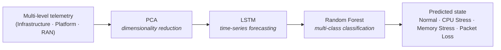

# autofm - Autonomous Fault Management

### Predict network faults before they cause outages.

`autofm` forecasts faults in Open RAN (O-RAN) deployments - CPU stress, memory
stress, packet loss - *before they happen*, so operators can act ahead of impact.

To do this, it fuses telemetry from all three layers of the stack - infrastructure, platform, RAN -
then runs a three-stage pipeline: **compress the data, forecast where it's heading, classify the
state.**

> 🏆 Built at the **European AI Hackathon 2026** by team **AFM_Ericsson**.

---

## Table of contents

- [The problem](#the-problem)
- [How it works](#how-it-works)
- [Hackathon goals](#hackathon-goals)
- [Team](#team)
- [Status](#status)
- [License](#license)

---

## The problem

Open RAN's disaggregated, multi-vendor design brings flexibility, but makes
resilience something you have to engineer, not assume. Faults can originate at three levels:

- **Infrastructure** - the host (CPU, memory, temperature)
- **Platform** - the network functions (e.g. CU, DU, RIC, core)
- **RAN** - the application (connected users, bitrate, signal quality)

**Watch only one level and you misdiagnose.** RAN packet loss can look like a link failure - when
the real cause is a host CPU throttling under a heat spike.

## How it works

Three stages, in plain terms: **compress the data, forecast where it's heading, then classify the
resulting state.**

| Stage | What it is | What it does here |
|-------|------------|-------------------|
| **PCA**  (Principal Component Analysis) | A way to shrink many columns of data down to the few that carry the most information. | Compresses dozens of redundant telemetry signals into a compact set - less compute, better scaling. |
| **LSTM**  (Long Short-Term Memory) | A neural network built for sequences over time. | Looks at recent telemetry history and forecasts the values a few moments ahead. |
| **Random Forest** | A classifier made of many decision trees that vote. | Reads the forecast and names the predicted state - robust to noisy data. |

## Hackathon goals

1. **GPU-accelerate** the LSTM forecaster (CPU → CUDA).
2. **Benchmark** the end-to-end pipeline.
3. **Scale** the pipeline toward production-scale telemetry volumes.

## Team

Team **AFM_Ericsson** - see [`docs/TEAM.md`](docs/TEAM.md).

## Status

🚧 Early development - hackathon project.

## Disclaimer

`autofm` is an independent project developed by the authors for the European AI
Hackathon 2026. It is **not** an official Ericsson product and is **not** endorsed
by or affiliated with Ericsson. Team members' employer is listed for professional
background only.

## License

[Apache License 2.0](LICENSE)
